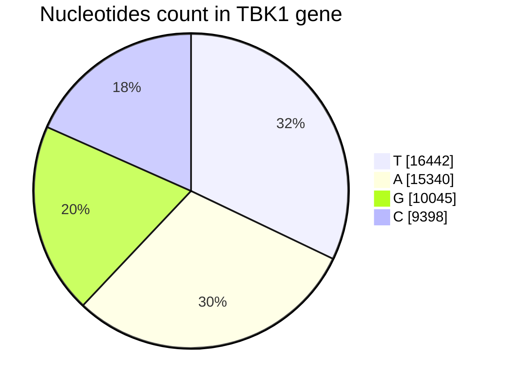

# 🧬 Human TBK1 gene analysis
Primary analysis on Human Gene TBK1 using python

## 🧾 SUMMARY
- Sequences length = 51225

### 📊 Nucleotides distribution:

<!--- Currently using githubs web view and mermaid for chart generation --->



|Nucleotides|count|
|-|-|
|T | 16442|
|A | 15340|
|G | 10045|
|C | 9398|

### 📉 Seqences found:

- Heavly reapeated sequences varying in length 2 to 5

|Length| Seqns| Count|
|------|------|------|
|2| TT| 3011|
|3| TTT| 868|
|4| TTTT| 308|
|5| TTTTT| 118|

- Seqences with maxmimum length:

|Length| Seqns| Count|
|------|------|------|
|28| CCTGTAATCCCAGCACTTTGGGAGGCCG| 2|

for more details look at [dna_seq_counts.csv](./dna_seq_counts.csv)

## 📝 About Script
The [script](./find_seqns.py) was made to perform rudimentary analysis of Human
gene sequences with *python* only using **re**.

### Instructions for using the script

Switch out input file

```py
# find_seqns.py Line 8
# Switch out the file location of the file you want analyzed

# Open and read the DNA sequence file
with open("./Homo_sapiens_TBK1_sequence.fa.txt", "r") as file:
    lines = file.readlines()[1:]
```

Run script

```sh
python find_seqns.py
```

<details>
<summary>Output</summary>

```
===SUMMARY===
Sequences length = 51225

Nucleotides distribution:
Nucleotides, count
T = 16442
A = 15340
G = 10045
C = 9398

Seqences found:
Length, Seqns, Count
2, TT, 3011
3, TTT, 868
4, TTTT, 308
5, TTTTT, 118
Seqences with maxmimum length:
28, CCTGTAATCCCAGCACTTTGGGAGGCCG, 2

Seqences counts have been exported to dna_seq_counts.csv
```

</details>

#### 📜 Features

- [x] Find Nucleotides distribution in gene
- [x] Find sequences in in Gene from length of 2 to 50
- [x] Modify sequence searching range
- [x] Write the sequences to a CSV file
- [x] Generate a summary about the findings
- [ ] Use cmdline args to feed file
- [ ] Check input file is a vaild FASTA file
- [ ] Use cmdline args to define sequence lengths
