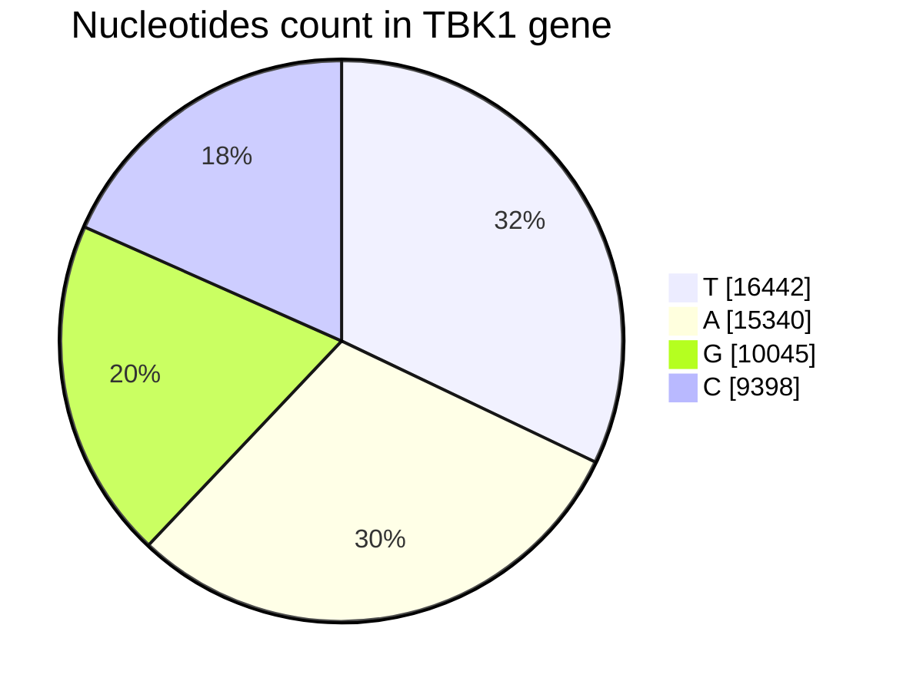

# Human_TBK1_gene_analysis
Primary analysis on Human Gene TBK1 using python

## SUMMARY
- Sequences length = 51225

### Nucleotides distribution:

|Nucleotides|count|
|-|-|
|T | 16442|
|A | 15340|
|G | 10045|
|C | 9398|

### Seqences found:

- Heavly reapeated sequences varying in length 2 to 5

|Length| Seqns| Count|
|------|------|------|
|2| TT| 3011|
|3| TTT| 868|
|4| TTTT| 308|
|5| TTTTT| 118|

- Seqences with maxmimum length:

|Length| Seqns| Count|
|------|------|------|
|28| CCTGTAATCCCAGCACTTTGGGAGGCCG| 2|

for more details look at [dna_seq_counts.csv](./dna_seq_counts.csv)
